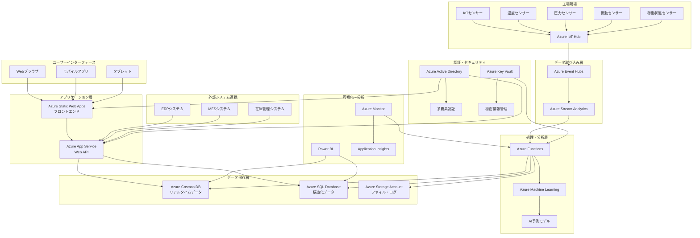
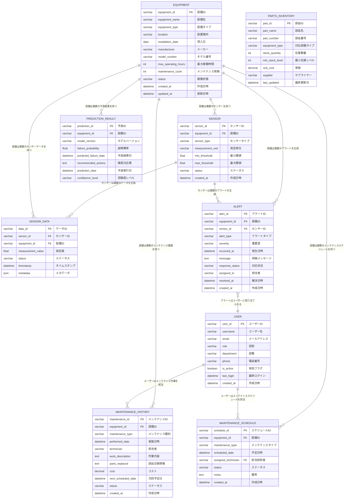
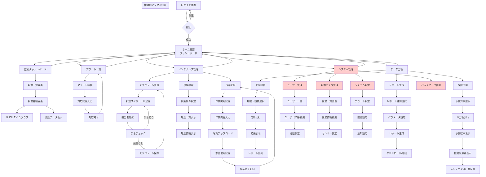
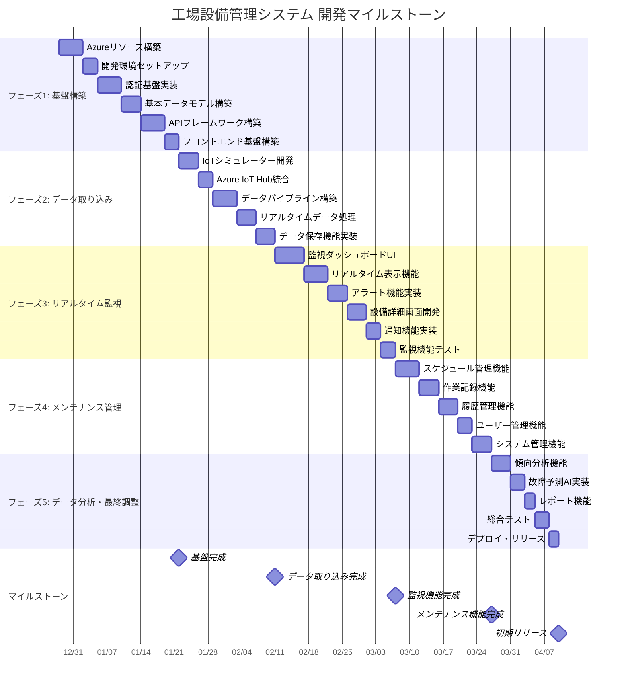

# 工場設備管理システム アプリケーションアーキテクチャ設計書

## 1. アプリケーションアーキテクチャ

以下のシステムアーキテクチャは、工場設備管理システムの全体構成を示しています。Azure クラウドサービスを活用したスケーラブルで信頼性の高いアーキテクチャです。

### アーキテクチャの主要コンポーネント

- **データ収集**: IoTセンサーからAzure IoT Hub経由でリアルタイムデータを収集
- **データ処理**: Azure Event HubsとStream Analyticsによるストリーミング処理
- **AI/ML**: Azure Machine Learningによる故障予測と異常検知
- **データ保存**: 用途別に最適化されたデータストア（Cosmos DB、SQL Database、Storage）
- **セキュリティ**: Azure AD統合とKey Vaultによる包括的なセキュリティ
- **可視化**: Power BIとカスタムダッシュボードによるデータ可視化

## 2. データモデル設計

以下のERDは、工場設備管理システムで扱う主要なデータエンティティとその関係を表しています。

### データモデルの特徴

- **正規化**: 第3正規形に準拠したデータベース設計
- **スケーラビリティ**: 時系列データ（SENSOR_DATA）はAzure Cosmos DBで管理
- **構造化データ**: マスタデータと履歴データはAzure SQL Databaseで管理
- **監査追跡**: created_at、updated_atによる変更履歴の追跡
- **柔軟性**: JSONメタデータフィールドによる拡張性の確保

## 3. 画面遷移図

以下の画面遷移図は、各ユーザー役割に応じたシステムの操作フローを示しています。

### 画面遷移の特徴

- **役割ベースアクセス制御**: ユーザーの役割に応じた画面制限
- **直感的ナビゲーション**: ホーム画面からすべての主要機能にアクセス可能
- **効率的ワークフロー**: 作業の流れに沿った画面遷移設計
- **モバイル対応**: レスポンシブデザインによるマルチデバイス対応

## 4. プロジェクトマイルストーン

### 4.1 リソース計算

**プロジェクト期間**: 2023年12月28日 ～ 2024年3月28日（3ヶ月 = 約13週間）

**利用可能工数の計算**:
- 開発者数: 3名
- 平均稼働率: 90%
- 営業日: 土日祝日を除く（約65営業日）
- 1日の作業時間: 8時間
- 総工数: 3名 × 65日 × 8時間 × 0.9 = 1,404時間

**フェーズ別工数配分**:
1. **フェーズ1（基盤構築）**: 351時間（25%）
2. **フェーズ2（データ取り込み）**: 281時間（20%）
3. **フェーズ3（リアルタイム監視）**: 351時間（25%）
4. **フェーズ4（メンテナンス管理）**: 281時間（20%）
5. **フェーズ5（データ分析）**: 140時間（10%）

### 4.2 詳細マイルストーン

### 4.3 優先順位と理由

**最優先（初期リリース必須機能）**:
1. **基盤構築**: すべての機能の土台となるため
2. **リアルタイム監視**: 工場運営に直接的な価値を提供
3. **アラート機能**: 安全性と効率性に直結

**高優先度**:
4. **メンテナンス管理**: 予防保全による長期的価値
5. **ユーザー管理**: セキュリティと運用管理

**中優先度**:
6. **データ分析**: 長期的な改善効果が期待される
7. **故障予測**: AI機能による付加価値

### 4.4 リスクと対策

**技術的リスク**:
- Azure サービス学習コスト: フェーズ1で集中的に技術習得
- IoT接続の複雑さ: シミュレーターで先行検証

**スケジュールリスク**:
- 外部システム連携の遅延: モックデータでの先行開発
- テスト期間の確保: 各フェーズでの継続的テスト実施

**品質リスク**:
- データ精度の確保: 検証機能の早期実装
- パフォーマンス要件: 負荷テストの計画実施

## 5. 次のステップ

この設計書に基づいて、以下の開発作業を順次実施していきます：

1. **Azure環境構築**: Infrastructure as Codeによる自動化
2. **開発チーム体制**: 役割分担と作業分担の明確化
3. **品質保証**: テスト戦略とCI/CDパイプラインの構築
4. **ユーザー受け入れ**: 段階的なユーザーフィードバックの収集

このアーキテクチャ設計により、スケーラブルで保守性の高い工場設備管理システムの実現を目指します。